# Lighthouse 性能优化详细计划

## 📊 当前性能评分分析

### 核心指标
- **性能得分**: 58/100 ⚠️
- **FCP (First Contentful Paint)**: 2.9秒 (+1)
- **LCP (Largest Contentful Paint)**: 4.8秒 (+2) 
- **TBT (Total Blocking Time)**: 30毫秒 (+30)
- **CLS (Cumulative Layout Shift)**: 0.006 (+25)
- **Speed Index**: 6.7秒 (+0)

### 关键问题识别

#### 🔴 严重问题 (高优先级)
1. **LCP过慢 (4.8秒)** - 目标 < 2.5秒
   - 元素渲染延迟: 7,150毫秒
   - 资源加载延迟: 640毫秒
   - 资源加载时长: 1,970毫秒
   - LCP元素: `img.w-full.h-full.object-cover`

2. **网络依赖关系树过深**
   - 关键路径延迟: 13,963毫秒
   - 最长链: 初始导航 → page.js → preload-helper.js → Swup.js → 其他依赖

3. **渲染阻塞资源 (40KB CSS)**
   - 6个CSS文件阻塞首屏渲染
   - 总传输大小: 40KB

4. **强制自动重排**
   - `_lighthouse-eval.js`: 148毫秒
   - `bootstrap-autofill-overlay.js`: 35毫秒
   - 多个Layout.astro相关重排

#### 🟡 中等问题
1. **未使用的CSS (31KB)**
   - Pico.css: 20.5KB未使用
   - _page_.CEKSadAt.css: 10.5KB未使用

2. **未使用的JavaScript (731KB)**
   - Chrome扩展脚本: 385KB (沉浸式翻译)
   - 其他扩展: 346.5KB

3. **未缩减的资源**
   - CSS可节省: 3KB
   - JavaScript可节省: 279KB

4. **屏幕外图片未延迟加载 (19KB)**
   - 多个自定义选择器图片
   - Base64编码的图片

#### 🟢 轻微问题
1. **第三方代码影响**
   - Chrome扩展主线程耗时: 388毫秒
   - Google Fonts: 53KB
   - 其他第三方: 7KB

2. **长时间运行的主线程任务**
   - 3个长任务被识别
   - 最长任务: 194毫秒

---

## 🎯 优化策略与实施计划

### 阶段一: 关键渲染路径优化 (预期提升 15-20分)

#### 1.1 优化CSS加载策略

**问题**: 40KB CSS阻塞渲染
**目标**: 减少到 < 15KB 关键CSS

**实施方案**:

```astro
<!-- src/layouts/Layout.astro -->
<!-- 内联关键CSS -->
<style is:inline>
  /* 仅包含首屏必需的样式 */
  :root { /* CSS变量 */ }
  body { /* 基础布局 */ }
  .card-base { /* 关键组件 */ }
</style>

<!-- 延迟加载非关键CSS -->
<link rel="preload" href="/_astro/_page_.CEKSadAt.css" as="style" onload="this.onload=null;this.rel='stylesheet'">
<noscript><link rel="stylesheet" href="/_astro/_page_.CEKSadAt.css"></noscript>
```

**配置调整**:
```javascript
// astro.config.mjs
export default defineConfig({
  build: {
    inlineStylesheets: 'always', // 内联小于10KB的CSS
  },
  vite: {
    build: {
      cssCodeSplit: true, // 启用CSS代码分割
    }
  }
});
```

#### 1.2 减少未使用的CSS

**移除Pico.css或按需引入**:
```javascript
// 方案1: 完全移除Pico.css，使用Tailwind替代
// 方案2: 使用PurgeCSS清理未使用样式

// postcss.config.mjs
import purgecss from '@fullhuman/postcss-purgecss';

export default {
  plugins: [
    purgecss({
      content: ['./src/**/*.{astro,html,js,jsx,md,mdx,svelte,ts,tsx,vue}'],
      safelist: ['dark', 'light', /^swup-/],
      defaultExtractor: content => content.match(/[\w-/:]+(?<!:)/g) || []
    })
  ]
};
```

#### 1.3 优化JavaScript加载

**代码分割优化**:
```javascript
// astro.config.mjs
vite: {
  build: {
    rollupOptions: {
      output: {
        manualChunks: {
          // 核心框架
          'framework': ['@swup/astro'],
          // UI组件
          'ui': ['photoswipe', 'overlayscrollbars'],
          // 工具库
          'utils': ['@iconify/svelte'],
          // 按路由分割
          'post': ['./src/components/PostPage.astro'],
          'archive': ['./src/components/ArchivePanel.svelte']
        }
      }
    }
  }
}
```

**动态导入非关键脚本**:
```javascript
// src/layouts/Layout.astro
<script>
// 延迟加载PhotoSwipe
if ('requestIdleCallback' in window) {
  requestIdleCallback(() => {
    import('photoswipe/lightbox').then(module => {
      // 初始化PhotoSwipe
    });
  });
} else {
  setTimeout(() => import('photoswipe/lightbox'), 2000);
}
</script>
```

---

### 阶段二: LCP优化 (预期提升 10-15分)

#### 2.1 优化LCP元素加载

**当前问题**:
- LCP元素: `img.w-full.h-full.object-cover`
- 元素渲染延迟: 7,150毫秒

**解决方案**:

```astro
<!-- 预加载LCP图片 -->
<link rel="preload" 
      as="image" 
      href="/path/to/lcp-image.webp"
      fetchpriority="high">

<!-- 优化图片标签 -->

```

#### 2.2 减少资源加载延迟

**优化字体加载**:
```html
<!-- 使用font-display: swap -->
<link rel="preconnect" href="https://fonts.googleapis.com">
<link rel="preconnect" href="https://fonts.gstatic.com" crossorigin>
<link rel="preload" 
      href="https://fonts.googleapis.com/css2?family=Roboto:wght@400;500;700&display=swap" 
      as="style">
<link rel="stylesheet" 
      href="https://fonts.googleapis.com/css2?family=Roboto:wght@400;500;700&display=swap" 
      media="print" 
      onload="this.media='all'">
```

#### 2.3 优化网络依赖链

**减少JavaScript链式加载**:
```javascript
// 当前: page.js → preload-helper.js → Swup.js (3层)
// 优化: 合并关键模块到单个bundle

// astro.config.mjs
vite: {
  build: {
    rollupOptions: {
      output: {
        manualChunks(id) {
          // 将Swup相关模块合并
          if (id.includes('swup') || id.includes('preload-helper')) {
            return 'swup-bundle';
          }
        }
      }
    }
  }
}
```

---

### 阶段三: 图片优化 (预期提升 5-8分)

#### 3.1 实施懒加载

**屏幕外图片延迟加载**:
```astro
<!-- src/components/ImageWrapper.astro -->
---
interface Props {
  src: string;
  alt: string;
  loading?: 'lazy' | 'eager';
  fetchpriority?: 'high' | 'low' | 'auto';
}

const { 
  src, 
  alt, 
  loading = 'lazy',
  fetchpriority = 'auto',
  ...rest 
} = Astro.props;
---


```

#### 3.2 优化图片格式

**使用现代图片格式**:
```astro
<picture>
  <source srcset="/image.avif" type="image/avif">
  <source srcset="/image.webp" type="image/webp">
  
</picture>
```

**Astro图片组件**:
```astro
---
import { Image } from 'astro:assets';
import bannerImage from '@/assets/images/banner.png';
---

<Image 
  src={bannerImage}
  alt="Banner"
  width={1200}
  height={630}
  format="webp"
  quality={80}
  loading="eager"
  fetchpriority="high"
/>
```

#### 3.3 Base64图片优化

**问题**: 自定义选择器中的Base64图片阻塞渲染

**解决方案**:
```javascript
// 将Base64图片转换为独立文件
// 使用懒加载
const customSelectImages = document.querySelectorAll('.custom-select-item-img');
const imageObserver = new IntersectionObserver((entries) => {
  entries.forEach(entry => {
    if (entry.isIntersecting) {
      const img = entry.target;
      img.src = img.dataset.src;
      imageObserver.unobserve(img);
    }
  });
});

customSelectImages.forEach(img => imageObserver.observe(img));
```

---

### 阶段四: 减少主线程阻塞 (预期提升 5-10分)

#### 4.1 消除强制重排

**问题代码定位**:
```javascript
// ❌ 导致强制重排
function badCode() {
  element.style.width = '100px';
  const height = element.offsetHeight; // 强制重排!
  element.style.height = height + 'px';
}

// ✅ 批量读取和写入
function goodCode() {
  // 批量读取
  const height = element.offsetHeight;
  
  // 批量写入
  requestAnimationFrame(() => {
    element.style.width = '100px';
    element.style.height = height + 'px';
  });
}
```

**优化Layout.astro中的DOM操作**:
```javascript
// src/layouts/Layout.astro
<script>
// 使用requestAnimationFrame批量处理DOM操作
function updateBannerHeight() {
  requestAnimationFrame(() => {
    const offset = Math.floor(window.innerHeight * (BANNER_HEIGHT_EXTEND / 100));
    const adjustedOffset = offset - offset % 4;
    document.documentElement.style.setProperty('--banner-height-extend', `${adjustedOffset}px`);
  });
}

// 使用防抖减少重排次数
const debouncedUpdate = debounce(updateBannerHeight, 150);
window.addEventListener('resize', debouncedUpdate);
</script>
```

#### 4.2 拆分长任务

**使用Scheduler API**:
```javascript
async function processLargeDataset(data) {
  const chunks = chunkArray(data, 50);
  
  for (const chunk of chunks) {
    await scheduler.yield(); // 让出主线程
    processChunk(chunk);
  }
}

// 降级方案
function yieldToMain() {
  return new Promise(resolve => {
    setTimeout(resolve, 0);
  });
}
```

#### 4.3 优化滚动处理

**使用Passive事件监听器**:
```javascript
// src/layouts/Layout.astro
window.addEventListener('scroll', throttle(scrollFunction, 100), { 
  passive: true // 提升滚动性能
});

// 使用Intersection Observer替代滚动监听
const observer = new IntersectionObserver((entries) => {
  entries.forEach(entry => {
    if (entry.isIntersecting) {
      // 处理可见性变化
    }
  });
}, {
  rootMargin: '50px' // 提前触发
});
```

---

### 阶段五: 第三方脚本优化 (预期提升 3-5分)

#### 5.1 延迟加载第三方脚本

**优化Clarity加载**:
```javascript
// src/layouts/Layout.astro
<script>
// 仅在用户交互后加载
let clarityLoaded = false;

function loadClarity() {
  if (clarityLoaded) return;
  clarityLoaded = true;
  
  const script = document.createElement('script');
  script.src = 'https://www.clarity.ms/tag/tdtze87osu?ref=bwt';
  script.async = true;
  document.head.appendChild(script);
}

// 延迟10秒或首次交互
setTimeout(loadClarity, 10000);
['click', 'scroll', 'keydown'].forEach(event => {
  window.addEventListener(event, loadClarity, { once: true, passive: true });
});
</script>
```

#### 5.2 优化Google Fonts

**使用字体子集**:
```html
<!-- 仅加载需要的字符集和字重 -->
<link rel="preconnect" href="https://fonts.googleapis.com">
<link rel="preconnect" href="https://fonts.gstatic.com" crossorigin>
<link href="https://fonts.googleapis.com/css2?family=Roboto:wght@400;700&display=swap&subset=latin" rel="stylesheet">
```

**自托管字体**:
```css
/* 使用@fontsource */
@import '@fontsource-variable/roboto';

/* 或手动定义 */
@font-face {
  font-family: 'Roboto';
  font-style: normal;
  font-weight: 400;
  font-display: swap;
  src: url('/fonts/roboto-v30-latin-regular.woff2') format('woff2');
}
```

#### 5.3 优化Iconify加载

**预加载常用图标**:
```javascript
// src/config.ts
export const preloadIcons = [
  'material-symbols:search',
  'fa6-solid:arrow-rotate-left',
  'material-symbols:menu'
];

// 在页面加载时预取
preloadIcons.forEach(icon => {
  const link = document.createElement('link');
  link.rel = 'prefetch';
  link.href = `https://api.iconify.design/${icon}.svg`;
  document.head.appendChild(link);
});
```

---

### 阶段六: 资源预连接优化 (预期提升 2-3分)

#### 6.1 优化预连接策略

```html
<!-- src/layouts/Layout.astro -->
<!-- 关键域名预连接 -->
<link rel="preconnect" href="https://fonts.googleapis.com">
<link rel="preconnect" href="https://fonts.gstatic.com" crossorigin>
<link rel="preconnect" href="https://get-views.freebird2913.tech">

<!-- 次要域名DNS预取 -->
<link rel="dns-prefetch" href="https://v1.hitokoto.cn">
<link rel="dns-prefetch" href="https://api.iconify.design">
<link rel="dns-prefetch" href="https://s.immersivetranslate.com">

<!-- 预加载关键资源 -->
<link rel="preload" href="/_astro/page.CUi_vaxE.js" as="script">
<link rel="preload" href="/fonts/roboto-v30-latin-regular.woff2" as="font" type="font/woff2" crossorigin>
```

#### 6.2 实施资源提示

```javascript
// 智能预取下一页
const links = document.querySelectorAll('a[href^="/posts/"]');
const linkObserver = new IntersectionObserver((entries) => {
  entries.forEach(entry => {
    if (entry.isIntersecting) {
      const link = entry.target;
      const prefetchLink = document.createElement('link');
      prefetchLink.rel = 'prefetch';
      prefetchLink.href = link.href;
      document.head.appendChild(prefetchLink);
    }
  });
}, { rootMargin: '200px' });

links.forEach(link => linkObserver.observe(link));
```

---

## 📈 预期性能提升

### 优化前后对比

| 指标 | 当前 | 目标 | 提升 |
|------|------|------|------|
| 性能得分 | 58 | 85+ | +27 |
| FCP | 2.9s | <1.8s | -1.1s |
| LCP | 4.8s | <2.5s | -2.3s |
| TBT | 30ms | <200ms | 保持 |
| CLS | 0.006 | <0.1 | 保持 |
| Speed Index | 6.7s | <3.4s | -3.3s |

### 分阶段提升预期

```mermaid
graph LR
    A[当前: 58分] --> B[阶段1: 73分]
    B --> C[阶段2: 83分]
    C --> D[阶段3: 88分]
    D --> E[阶段4: 91分]
    E --> F[阶段5: 93分]
    F --> G[阶段6: 95分]
```



---

## 🔧 实施优先级

### P0 - 立即执行 (1-2天)
1. ✅ 内联关键CSS
2. ✅ 优化LCP图片加载
3. ✅ 减少渲染阻塞CSS
4. ✅ 实施图片懒加载

### P1 - 高优先级 (3-5天)
1. ⚡ 优化JavaScript代码分割
2. ⚡ 消除强制重排
3. ⚡ 延迟加载第三方脚本
4. ⚡ 优化网络依赖链

### P2 - 中优先级 (1周)
1. 🔄 清理未使用的CSS/JS
2. 🔄 优化字体加载策略
3. 🔄 实施资源预连接
4. 🔄 拆分长任务

### P3 - 低优先级 (持续优化)
1. 📊 性能监控和分析
2. 📊 A/B测试优化效果
3. 📊 持续优化和调整

---

## 🎯 关键性能指标目标

### Core Web Vitals目标

```
LCP (Largest Contentful Paint)
├─ 当前: 4.8秒 ❌
├─ 目标: < 2.5秒 ✅
└─ 优化策略:
   ├─ 预加载LCP图片
   ├─ 优化服务器响应时间
   ├─ 减少资源加载延迟
   └─ 消除渲染阻塞资源

FID/INP (First Input Delay / Interaction to Next Paint)
├─ 当前: TBT 30ms ✅
├─ 目标: < 100ms ✅
└─ 优化策略:
   ├─ 拆分长任务
   ├─ 延迟加载非关键JS
   └─ 优化事件处理器

CLS (Cumulative Layout Shift)
├─ 当前: 0.006 ✅
├─ 目标: < 0.1 ✅
└─ 保持策略:
   ├─ 为图片设置尺寸
   ├─ 避免动态插入内容
   └─ 使用font-display: swap
```

---

## 📝 监控和验证

### 性能监控工具

1. **Lighthouse CI**
```yaml
# .github/workflows/lighthouse.yml
name: Lighthouse CI
on: [push]
jobs:
  lighthouse:
    runs-on: ubuntu-latest
    steps:
      - uses: actions/checkout@v3
      - uses: treosh/lighthouse-ci-action@v9
        with:
          urls: |
            https://www.freebird2913.tech/
          uploadArtifacts: true
```

2. **Web Vitals监控**
```javascript
// src/utils/web-vitals.js
import { onCLS, onFID, onLCP } from 'web-vitals';

function sendToAnalytics(metric) {
  const body = JSON.stringify(metric);
  // 发送到分析服务
  navigator.sendBeacon('/api/analytics', body);
}

onCLS(sendToAnalytics);
onFID(sendToAnalytics);
onLCP(sendToAnalytics);
```

3. **性能预算**
```javascript
// lighthouserc.js
module.exports = {
  ci: {
    collect: {
      numberOfRuns: 3,
    },
    assert: {
      assertions: {
        'categories:performance': ['error', { minScore: 0.85 }],
        'first-contentful-paint': ['error', { maxNumericValue: 2000 }],
        'largest-contentful-paint': ['error', { maxNumericValue: 2500 }],
        'cumulative-layout-shift': ['error', { maxNumericValue: 0.1 }],
      },
    },
  },
};
```

---

## 🚀 快速开始

### 立即可执行的优化

1. **添加资源提示**
```html
<!-- 在<head>中添加 -->
<link rel="preconnect" href="https://fonts.googleapis.com">
<link rel="dns-prefetch" href="https://api.iconify.design">
```

2. **优化图片加载**
```html
<!-- 为LCP图片添加 -->


<!-- 为其他图片添加 -->

```

3. **延迟非关键CSS**
```html
<link rel="preload" href="style.css" as="style" onload="this.onload=null;this.rel='stylesheet'">
```

4. **延迟第三方脚本**
```javascript
// 延迟5秒加载
setTimeout(() => {
  // 加载第三方脚本
}, 5000);
```

---

## 📚 参考资源

- [Web.dev - Optimize LCP](https://web.dev/optimize-lcp/)
- [Web.dev - Reduce JavaScript](https://web.dev/reduce-javascript-payloads-with-code-splitting/)
- [MDN - Lazy Loading](https://developer.mozilla.org/en-US/docs/Web/Performance/Lazy_loading)
- [Chrome DevTools - Performance](https://developer.chrome.com/docs/devtools/performance/)

---

## ✅ 验收标准

优化完成后应达到:
- ✅ Lighthouse性能得分 ≥ 85
- ✅ LCP < 2.5秒
- ✅ FCP < 1.8秒
- ✅ TBT < 200毫秒
- ✅ CLS < 0.1
- ✅ Speed Index < 3.4秒

---

**创建时间**: 2025-10-25
**最后更新**: 2025-10-25
**负责人**: Kilo Code (Architect Mode)