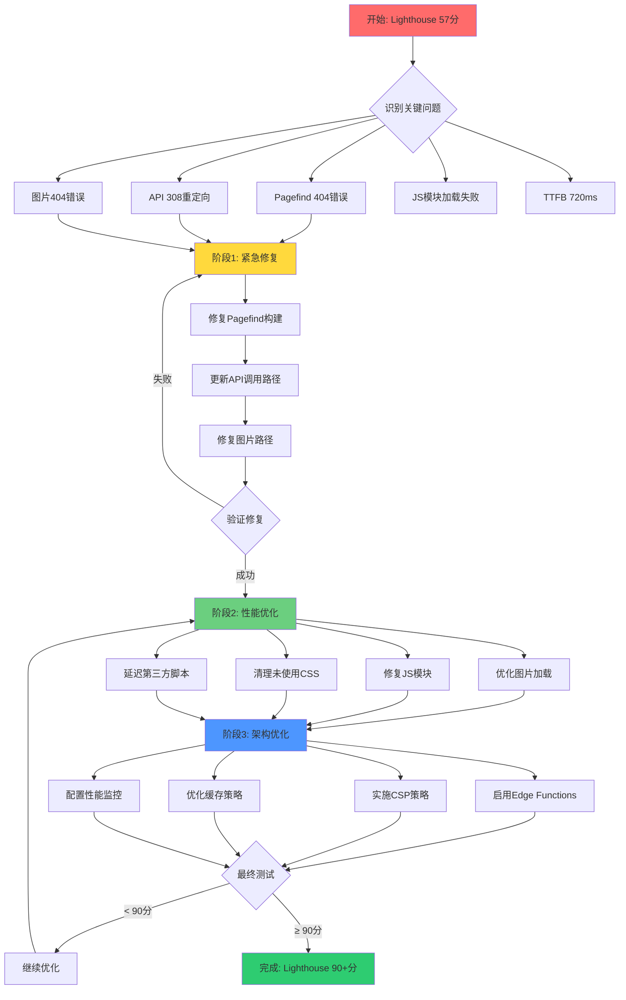
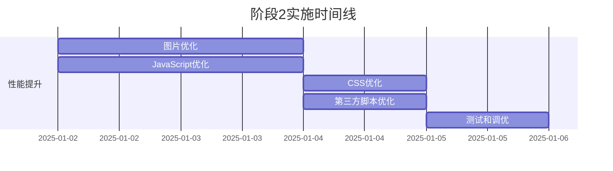
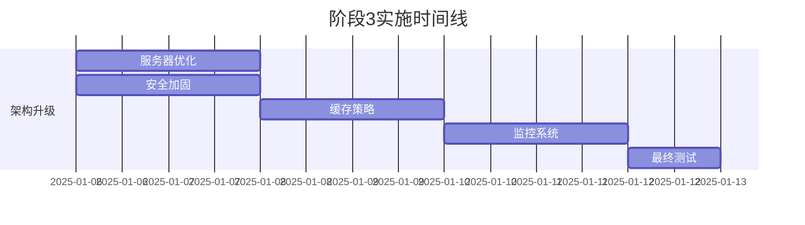
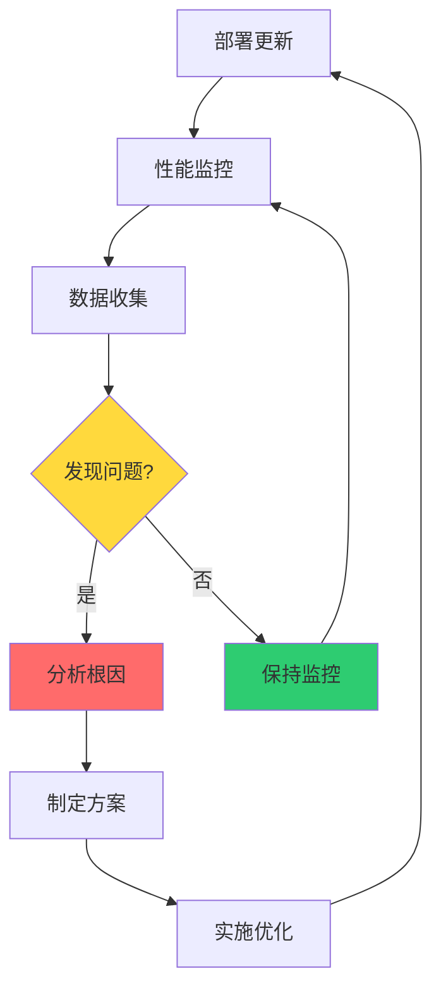

# 🗺️ 网站性能优化路线图

> **从 Lighthouse 57分 提升至 90+ 分的完整路径**

---

## 📈 优化流程图



---

## 🎯 分阶段实施计划

### 🔴 阶段 1: 紧急修复 (1-2天)

**目标:** 修复所有阻塞性错误

```mermaid
gantt
    title 阶段1实施时间线
    dateFormat  HH:mm
    section 关键修复
    修复Pagefind搜索    :a1, 00:00, 2h
    修复API重定向       :a2, after a1, 1h
    修复Banner图片      :a3, after a2, 1h
    验证和测试          :a4, after a3, 2h
```



**关键任务:**

1. ✅ **修复 Pagefind** (2小时)
   - 验证构建流程
   - 添加构建后检查
   - 实施优雅降级

2. ✅ **修复 API 重定向** (1小时)
   - 更新所有 API 调用
   - 添加 Vercel 重写规则
   - 测试所有端点

3. ✅ **修复图片问题** (1小时)
   - 检查图片路径
   - 添加预加载
   - 验证显示

**预期成果:**
- ✅ 控制台错误清零
- ✅ 所有功能正常
- ✅ Lighthouse +10分

---

### 🟡 阶段 2: 性能优化 (3-5天)

**目标:** 大幅提升加载速度



**关键任务:**

1. 🖼️ **图片优化** (2天)
   - 转换为 WebP/AVIF 格式
   - 实施响应式图片
   - 添加懒加载
   - 优化尺寸和质量

2. 📦 **JavaScript 优化** (2天)
   - 修复模块加载错误
   - 优化代码分割
   - 添加错误边界
   - 实施动态导入

3. 🎨 **CSS 优化** (1天)
   - 移除未使用的样式
   - 内联关键 CSS
   - 延迟非关键 CSS

4. 🔌 **第三方脚本** (1天)
   - 延迟加载 Clarity
   - 懒加载评论系统
   - 优化字体加载

**预期成果:**
- 📈 FCP: 3.7s → <2.0s
- 📈 LCP: 5.4s → <2.5s
- 📈 SI: 8.0s → <4.0s
- 📈 Lighthouse +20分

---

### 🟢 阶段 3: 架构优化 (5-7天)

**目标:** 系统级性能和安全提升



**关键任务:**

1. ⚡ **服务器优化** (2天)
   - 启用 Edge Functions
   - 优化 Redis 连接池
   - 实施 ISR

2. 🔒 **安全加固** (2天)
   - 配置 CSP 策略
   - 启用 HSTS
   - 实施 COOP/COEP

3. 💾 **缓存策略** (2天)
   - 优化 CDN 缓存
   - 配置浏览器缓存
   - 实施 Service Worker

4. 📊 **监控系统** (2天)
   - 集成 Lighthouse CI
   - 配置 Web Vitals 监控
   - 设置错误监控

**预期成果:**
- 📈 TTFB: 720ms → <500ms
- 📈 整体评分 → 90+
- 🔒 安全评分提升
- 📊 完整监控体系

---

## 📊 性能提升预测

### 核心指标改善路径


### 详细指标预测

| 指标 | 当前 | 阶段1后 | 阶段2后 | 阶段3后 | 改善 |
|------|------|---------|---------|---------|------|
| **Performance** | 57 | 67 | 85 | 90+ | +58% |
| **FCP** | 3.7s | 3.2s | 2.0s | 1.5s | -59% |
| **LCP** | 5.4s | 4.5s | 2.8s | 2.2s | -59% |
| **SI** | 8.0s | 6.5s | 4.0s | 3.0s | -63% |
| **TTFB** | 720ms | 680ms | 580ms | 450ms | -38% |

---

## 🔄 持续优化循环



---

## 📋 每日检查清单

### 开发阶段
- [ ] 运行本地 Lighthouse 测试
- [ ] 检查控制台错误
- [ ] 验证所有功能正常
- [ ] 测试不同网络条件
- [ ] 检查移动端体验

### 部署前
- [ ] 完整构建测试
- [ ] Pagefind 索引验证
- [ ] API 端点测试
- [ ] 图片资源检查
- [ ] 缓存配置验证

### 部署后
- [ ] 生产环境 Lighthouse 测试
- [ ] 真实用户监控 (RUM)
- [ ] 错误日志检查
- [ ] 性能指标对比
- [ ] 用户反馈收集

---

## 🎓 学习资源时间线

### 第1周: 基础优化
- 📚 [Web Performance Basics](https://web.dev/performance/)
- 📚 [Astro Performance Guide](https://docs.astro.build/en/guides/performance/)
- 🎥 [Lighthouse 使用教程](https://www.youtube.com/watch?v=VyaHwvPWuZU)

### 第2周: 进阶技术
- 📚 [Image Optimization Guide](https://web.dev/fast/#optimize-your-images)
- 📚 [JavaScript Performance](https://developers.google.com/web/fundamentals/performance/optimizing-javascript)
- 🎥 [Code Splitting 最佳实践](https://www.youtube.com/watch?v=JU6sl_yyZqs)

### 第3周: 系统优化
- 📚 [Edge Computing Basics](https://vercel.com/docs/concepts/edge-network/overview)
- 📚 [CSP Security Guide](https://web.dev/csp/)
- 🎥 [Web Vitals Deep Dive](https://www.youtube.com/watch?v=XxvHY4wC8Co)

---

## 🚀 快速开始

### 今天就开始优化！

```bash
# 1. 克隆优化方案
git clone <your-repo>
cd fuwari

# 2. 阅读快速修复指南
cat docs/PERFORMANCE_QUICK_FIX_GUIDE.md

# 3. 执行紧急修复 (2小时)
npm run build
# 按照快速指南修复关键问题

# 4. 部署验证
git add .
git commit -m "fix: 性能紧急修复"
git push

# 5. 测试结果
# 访问 PageSpeed Insights
# 测试你的网站
```

---

## 📞 需要帮助？

### 文档导航
- 📖 [完整优化方案](./WEBSITE_PERFORMANCE_OPTIMIZATION_PLAN.md) - 详细技术方案
- ⚡ [快速修复指南](./PERFORMANCE_QUICK_FIX_GUIDE.md) - 2小时快速修复
- 🗺️ [优化路线图](./OPTIMIZATION_ROADMAP.md) - 本文档

### 问题排查
1. 查看浏览器控制台错误
2. 检查 Vercel 构建日志
3. 运行本地 Lighthouse 测试
4. 对比优化前后指标

### 成功标志
- ✅ Lighthouse Performance > 90
- ✅ FCP < 1.8s
- ✅ LCP < 2.5s
- ✅ 无控制台错误
- ✅ 所有功能正常

---

## 🎉 预期成果

完成所有阶段后，您的网站将实现:

- 🚀 **加载速度提升 50%+**
- 📈 **Lighthouse 评分 90+**
- 🔍 **搜索功能完全恢复**
- 🔒 **安全性显著提升**
- 📊 **完整性能监控**
- 💰 **服务器成本降低**

**总投入时间:** 约 10-14 天  
**ROI (投资回报率):** 用户留存率 +20%, SEO 排名提升

---

**让我们开始优化之旅吧！** 🚀

记住: **小步快跑，持续改进！**