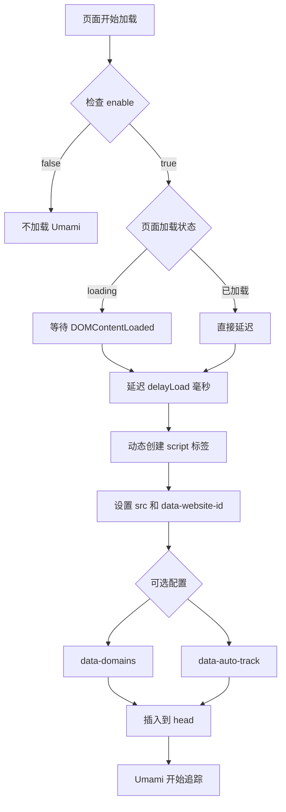

# Umami 分析服务集成文档

## 📊 概述

本项目已成功集成 Umami 分析服务,用于网站访问统计和用户行为分析。Umami 是一个开源、隐私友好的网站分析工具,不使用 Cookie,完全符合 GDPR 等隐私法规。

## 🎯 功能特性

- ✅ **完全配置化**: 所有参数可在配置文件中修改
- ✅ **性能优化**: 延迟加载,不影响首屏性能
- ✅ **隐私友好**: 不使用 Cookie,符合 GDPR
- ✅ **独立组件**: 易于维护和复用
- ✅ **类型安全**: 完整的 TypeScript 类型定义
- ✅ **灵活控制**: 支持开关、域名限制、自动追踪等配置

## 📁 文件结构

```
src/
├── types/config.ts              # UmamiConfig 类型定义
├── config.ts                    # Umami 配置
├── components/
│   └── UmamiAnalytics.astro    # Umami 分析组件
└── layouts/
    └── Layout.astro            # 主布局(已集成 Umami)
```

## ⚙️ 配置说明

### 配置文件位置

配置位于 [`src/config.ts`](../src/config.ts) 文件中:

```typescript
export const umamiConfig: UmamiConfig = {
	enable: true,                                          // 是否启用 Umami
	src: "https://views.freebird2913.tech/script.js",     // Umami 脚本地址
	websiteId: "726431d7-e252-486d-ab90-350313e5a519",    // 网站 ID
	domains: "www.freebird2913.tech",                     // 限制追踪的域名
	autoTrack: true,                                       // 自动追踪页面浏览
	delayLoad: 2000,                                       // 延迟加载时间(毫秒)
};
```

### 配置参数详解

| 参数 | 类型 | 必填 | 默认值 | 说明 |
|------|------|------|--------|------|
| `enable` | boolean | ✅ | - | 是否启用 Umami 分析 |
| `src` | string | ✅ | - | Umami 脚本的完整 URL 地址 |
| `websiteId` | string | ✅ | - | 在 Umami 后台创建网站时获得的唯一 ID |
| `domains` | string | ❌ | undefined | 限制追踪的域名,多个域名用逗号分隔 |
| `autoTrack` | boolean | ❌ | true | 是否自动追踪页面浏览事件 |
| `delayLoad` | number | ❌ | 2000 | 延迟加载时间(毫秒),用于优化首屏性能 |

## 🚀 使用方法

### 1. 启用 Umami

在 [`src/config.ts`](../src/config.ts) 中设置 `enable: true`:

```typescript
export const umamiConfig: UmamiConfig = {
	enable: true,
	src: "https://your-umami-instance.com/script.js",
	websiteId: "your-website-id",
};
```

### 2. 禁用 Umami

设置 `enable: false`:

```typescript
export const umamiConfig: UmamiConfig = {
	enable: false,
	src: "",
	websiteId: "",
};
```

### 3. 高级配置示例

#### 多域名追踪

```typescript
export const umamiConfig: UmamiConfig = {
	enable: true,
	src: "https://views.freebird2913.tech/script.js",
	websiteId: "726431d7-e252-486d-ab90-350313e5a519",
	domains: "www.freebird2913.tech,freebird2913.tech,blog.freebird2913.tech",
	autoTrack: true,
	delayLoad: 2000,
};
```

#### 自定义延迟时间

```typescript
export const umamiConfig: UmamiConfig = {
	enable: true,
	src: "https://views.freebird2913.tech/script.js",
	websiteId: "726431d7-e252-486d-ab90-350313e5a519",
	delayLoad: 3000,  // 3秒后加载
};
```

#### 禁用自动追踪(手动追踪)

```typescript
export const umamiConfig: UmamiConfig = {
	enable: true,
	src: "https://views.freebird2913.tech/script.js",
	websiteId: "726431d7-e252-486d-ab90-350313e5a519",
	autoTrack: false,  // 需要手动调用 umami.track()
};
```

## 🔧 技术实现

### 组件架构

[`UmamiAnalytics.astro`](../src/components/UmamiAnalytics.astro) 组件采用延迟加载策略:

```astro
---
import { umamiConfig } from "@/config";

// 如果未启用,不渲染任何内容
if (!umamiConfig.enable) {
	return;
}
---

<!-- 延迟加载 Umami 脚本 -->
<script is:inline>
	// 页面加载后延迟指定时间再加载 Umami
	// 避免阻塞首屏渲染
</script>
```

### 加载流程



### 性能优化

1. **延迟加载**: 默认在页面加载 2 秒后才加载 Umami 脚本
2. **异步加载**: 使用 `async` 和 `defer` 属性,不阻塞页面渲染
3. **条件渲染**: 如果 `enable: false`,组件不会渲染任何内容
4. **动态插入**: 使用 JavaScript 动态创建 script 标签,避免 HTML 解析阻塞

## 📊 数据追踪

### 自动追踪的事件

当 `autoTrack: true` 时,Umami 会自动追踪:

- 页面浏览 (Page Views)
- 页面停留时间 (Time on Page)
- 跳出率 (Bounce Rate)
- 访问来源 (Referrers)
- 浏览器和设备信息
- 地理位置(国家/地区)

### 手动追踪事件

如果需要追踪自定义事件,可以使用 Umami 的 JavaScript API:

```javascript
// 追踪按钮点击
umami.track('button-click', { button: 'download' });

// 追踪表单提交
umami.track('form-submit', { form: 'contact' });

// 追踪自定义事件
umami.track('custom-event', { 
  category: 'engagement',
  action: 'scroll',
  value: 50 
});
```

## 🔍 验证集成

### 1. 检查脚本加载

在浏览器开发者工具中:

1. 打开 **Network** 标签
2. 刷新页面
3. 等待 2 秒(或你设置的 `delayLoad` 时间)
4. 查找 `script.js` 请求
5. 确认状态码为 `200 OK`

### 2. 检查控制台

在浏览器控制台中输入:

```javascript
console.log(window.umami);
```

如果返回一个对象(而不是 `undefined`),说明 Umami 已成功加载。

### 3. 查看 Umami 后台

1. 登录你的 Umami 后台
2. 选择对应的网站
3. 查看实时访问数据
4. 确认页面浏览事件被正确记录

## 🛠️ 故障排查

### 问题 1: Umami 脚本未加载

**可能原因:**
- `enable` 设置为 `false`
- `src` 地址错误
- 网络问题或 Umami 服务器不可用

**解决方法:**
1. 检查 [`src/config.ts`](../src/config.ts) 中的配置
2. 在浏览器中直接访问 `src` 地址,确认脚本可访问
3. 检查浏览器控制台是否有错误信息

### 问题 2: 数据未在 Umami 后台显示

**可能原因:**
- `websiteId` 错误
- `domains` 配置限制了当前域名
- 浏览器启用了广告拦截器

**解决方法:**
1. 确认 `websiteId` 与 Umami 后台一致
2. 检查 `domains` 配置是否包含当前域名
3. 暂时禁用广告拦截器测试
4. 检查浏览器是否启用了 "Do Not Track"

### 问题 3: 影响页面性能

**可能原因:**
- `delayLoad` 设置过小
- 网络延迟

**解决方法:**
1. 增加 `delayLoad` 值(如 3000 或 5000)
2. 考虑使用 CDN 加速 Umami 脚本

## 🔐 隐私和合规

### GDPR 合规

Umami 是 GDPR 友好的分析工具:

- ✅ 不使用 Cookie
- ✅ 不收集个人身份信息
- ✅ 数据匿名化
- ✅ 符合隐私法规

### 数据收集说明

Umami 收集的数据:

- **收集**: 页面 URL、访问时间、浏览器类型、设备类型、地理位置(国家/地区)
- **不收集**: IP 地址、个人身份信息、Cookie

## 📚 相关资源

- [Umami 官方文档](https://umami.is/docs)
- [Umami GitHub](https://github.com/umami-software/umami)
- [Umami API 文档](https://umami.is/docs/api)
- [隐私政策最佳实践](https://umami.is/docs/privacy)

## 🤝 贡献

如果你发现问题或有改进建议,欢迎:

1. 提交 Issue
2. 创建 Pull Request
3. 更新文档

## 📝 更新日志

### v1.0.0 (2025-10-11)

- ✅ 初始集成 Umami 分析服务
- ✅ 添加完整的类型定义
- ✅ 实现延迟加载优化
- ✅ 创建独立组件
- ✅ 添加配置化支持
- ✅ 编写完整文档

## 📧 支持

如有问题,请联系:

- 项目维护者: freebird2913
- GitHub: [@acleverfreebird](https://github.com/acleverfreebird)
- 博客: [https://www.freebird2913.tech](https://www.freebird2913.tech)

---

**最后更新**: 2025-10-11  
**文档版本**: 1.0.0