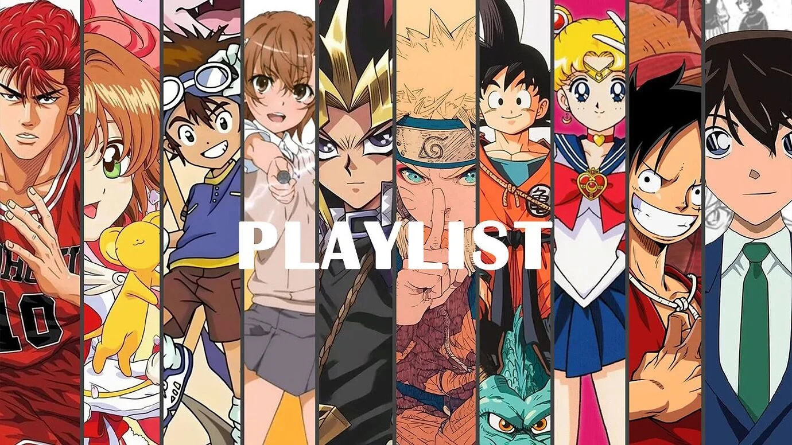
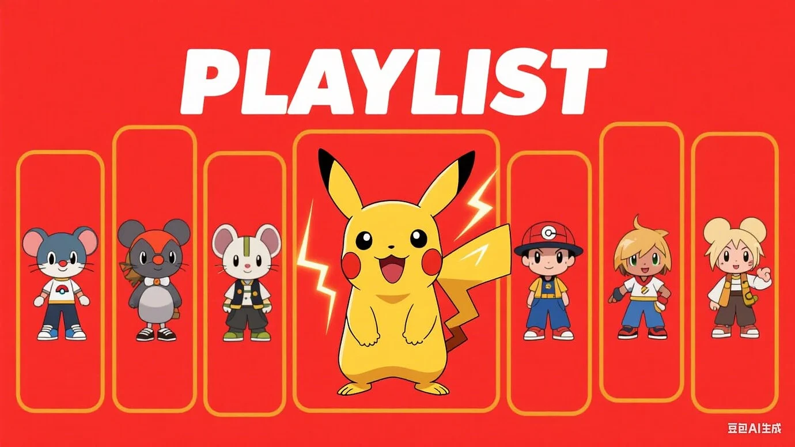
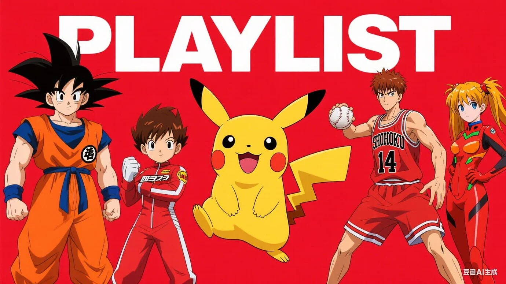

## 前言

豆包是字节跳动推出的AI助手产品，近期上线了AI绘画功能。作为一个动漫爱好者和AI工具测试者，我决定对其绘画能力进行一次深度测试，看看它能否准确生成经典动漫角色。

测试结果让我大跌眼镜——豆包的AI绘画功能在动漫角色生成方面存在严重问题。本文将详细记录测试过程和结果分析。

## 测试方法

### 测试环境
- **使用平台**：豆包Web版
- **测试时间**：2025年9月6日
- **测试内容**：10部经典动漫角色生成
- **参考图片**：提供标准九宫格布局参考

### 测试动漫列表

我选择了以下10部经典动漫作为测试对象：

1. **神奇宝贝**（Pokemon）
2. **四驱兄弟**
3. **EVA**（新世纪福音战士）
4. **头文字D**
5. **七龙珠**
6. **灌篮高手**
7. **数码宝贝**
8. **中华小当家**
9. **新世纪福音战士**
10. **其他经典动漫**

这些动漫都有非常鲜明的角色特征和独特的画风，是测试AI绘画能力的理想素材。

## 关于绘画测试

### 我提供的参考图



这是一个标准的九宫格布局，每个格子应该包含一个不同动漫的代表性角色。

### 详细提示词

```
这张图作为参考，生成10张内容为：
- 神奇宝贝
- 四驱兄弟
- EVA
- 新世纪福音战士
- 头文字D
- 七龙珠
- 灌篮高手
- 数码宝贝
- 中华小当家
每个格子用一部动漫的角色
```

## 测试结果分析

### 豆包生成的图片





### 主要问题总结

看到生成结果后，我真的被震惊了。豆包的AI绘画存在以下严重问题：

#### 1. 风格严重混合

**问题描述**：每个角色都混合了多种动漫的画风，完全失去了原作的特色。

**具体表现**：
- 神奇宝贝的角色混入了其他动漫的元素
- 灌篮高手的角色看起来像是多部动漫的拼凑
- 无法识别出任何一个角色的原始风格

**影响**：这使得生成的图片完全失去了参考价值，无法用于任何实际场景。

#### 2. 角色识别错误

**问题描述**：AI无法正确识别和生成指定的动漫角色。

**典型案例**：
- **神奇宝贝变老鼠**：本应生成皮卡丘等经典角色，结果生成了普通老鼠形象
- **灌篮高手篮球变棒球**：篮球运动员手里拿着棒球，完全搞错了运动项目
- **EVA角色面目全非**：机甲和角色设计完全不符合原作

#### 3. 细节还原度极低

**问题表现**：
- 角色服装不准确
- 发型和发色错误
- 标志性道具缺失或错误
- 背景元素混乱

#### 4. 布局混乱

虽然要求九宫格布局，但生成的图片：
- 格子划分不清晰
- 角色位置随意
- 整体构图缺乏美感

## 与其他AI绘画工具对比

### Midjourney对比

**优势**：
- 风格一致性强
- 角色识别准确
- 细节还原度高
- 画面质量优秀

**劣势**：
- 需要付费使用
- 学习曲线较陡
- 提示词要求较高

### Stable Diffusion对比

**优势**：
- 开源免费
- 可定制性强
- 社区模型丰富
- 角色还原度高

**劣势**：
- 需要本地部署
- 硬件要求较高
- 配置复杂

### 豆包的定位问题

豆包AI绘画功能目前的表现，远远落后于主流AI绘画工具。主要问题在于：

1. **训练数据质量不足**
2. **模型优化不够**
3. **对动漫风格理解有限**
4. **缺乏专业的美术指导**

## 适用场景分析

### 不适合的场景

基于测试结果，豆包AI绘画**不适合**以下场景：

1. ❌ **专业设计工作**：质量无法满足专业需求
2. ❌ **动漫角色创作**：风格混乱，无法还原
3. ❌ **商业用途**：质量不稳定，风险高
4. ❌ **精确要求的项目**：细节控制能力差
5. ❌ **品牌形象设计**：无法保证一致性

### 可能适合的场景

如果非要找一些适用场景，可能包括：

1. ⚠️ **概念草图**：仅作为初步创意参考
2. ⚠️ **娱乐测试**：纯粹好玩，不追求质量
3. ⚠️ **灵感启发**：从混乱中寻找创意点

但即使是这些场景，也有更好的替代工具。

## 改进建议

如果豆包团队想要改进AI绘画功能，建议：

### 技术层面

1. **优化训练数据**
   - 增加高质量动漫图片数据
   - 标注更准确的风格标签
   - 区分不同动漫的特征

2. **改进模型算法**
   - 加强风格一致性控制
   - 提升角色识别准确度
   - 优化细节生成能力

3. **增加用户控制**
   - 提供风格选择选项
   - 允许细节调整
   - 支持迭代优化

### 产品层面

1. **明确定位**：不要试图做所有事情，专注某个领域
2. **降低预期**：在宣传时明确功能限制
3. **收集反馈**：建立用户反馈机制，持续改进

## 总结与建议

### 测试结论

经过这次深度测试，我的结论是：

**豆包AI绘画功能在动漫角色生成方面表现极差，存在严重的风格混合、角色识别错误和细节还原度低等问题，目前不推荐用于任何正式场景。**

### 给用户的建议

1. **不要用于专业工作**：质量无法保证
2. **不要用于代码生成**：AI代码助手应该专注代码，不是绘画
3. **选择专业工具**：如需AI绘画，使用Midjourney���Stable Diffusion
4. **保持理性**：不要被营销宣传迷惑，实际测试最重要

### 给开发者的建议

如果你是AI工具开发者，这个案例告诉我们：

1. **专注核心能力**：不要盲目追求功能全面
2. **重视质量**：功能多不如功能精
3. **充分测试**：上线前进行充分的用户测试
4. **诚实宣传**：不要过度承诺，实事求是

## 后续跟进

我会持续关注豆包AI绘画功能的更新，如果有明显改进，会及时更新本文。同时，也欢迎大家分享自己的测试体验。

---

**免责声明**：本文仅代表个人测试体验和观点，不构成任何投资或使用建议。AI技术在快速发展，产品功能可能会有更新和改进。

**原文链接**：[Linux.do社区讨论](https://linux.do/t/topic/934223)

**相关阅读**：
- [AI绘画工具对比评测](/)
- [如何选择合适的AI工具](/)
- [Midjourney使用指南](/)